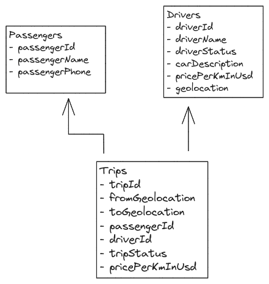

# Taxi24-API


## Description

This application showcases an example solution for managing and assigning taxi rides to drivers based on passenger requests, utilizing proximity-based search between the passenger and the taxi.

## Requires
* NodeJS
* NPM
* Docker

## Installation and Running Application

We need to install first the packages for the project and then we will be able to execute the application using docker-compose. 

```bash
$ npm install
```

Copy the .env.sample to .env. The .env.sample has all environment needed to run the project in docker.
```bash
$ cp .env.sample .env
```

Once we did all before, we can execute docker-compose up to run the project an test it.
```bash
$ docker-compose up
```

If you want to execute the project in local, you should have PostgreSQL installed and running with a database created or you can run the next command to up a docker image of PostgreSQL
```bash
$ docker run --rm -d -p 5432:5432 \
  -e POSTGRES_USER=taxi24User \
  -e POSTGRES_PASSWORD=SuperPowerfull24Pass \
  -e POSTGRES_DB=taxi24 \
  --name taxi-postgres \
  postgis/postgis:15-3.3-alpine
```

And then execute the project with:
```bash
$ npm run start
```

To see the documentation you can open the page [localhost:8000/docs](http://localhost:8000/docs)

## Test

```bash
# unit tests
$ npm run test

# e2e tests
$ npm run test:e2e:local

# test coverage
$ npm run test:cov
```

## Project Requirements:
The requirements are divided into 3 mains features, Drivers, Passengers and Trips.

### Drivers
* Get a list of all drivers.
* Get a list of all available drivers.
* Get a list of all available drivers within a 3 km radius for a specific location.
* Get a specific driver by ID.

### Passengers
* Get a list of all the passengers.
* Get a specific passenger by their ID.
* Get a list of the 3 drivers closest to the starting point for a passenger requesting a trip.

### Trips
* Create a new trip request by assigning a driver to a passenger.
* Completing a trip.
* Get a list of all active trips.

## Diagrams

### Database Schemas



## How each requirement is solved

Next are the cURL commands to perform each of the required operations:

### Drivers

1. Get a list of all drivers.
```bash
curl -X GET "http://localhost:8000/drivers"
```

2. Get a list of all available drivers.
```bash
curl -X GET "http://localhost:8000/drivers?driverStatus=available"
```

3. Get a list of all available drivers within a 3 km radius for a specific location.
```bash
curl -X GET "http://localhost:8000/drivers?driverStatus=available&nearToGeolocation={\"latitude\": 10, \"longitude\": 20, \"maxDistanceInKm\": 3}"
```

4. Get a specific driver by ID.
```bash
curl -X GET "http://localhost:8000/drivers/{driverId}"
```

### Passengers

1. Get a list of all passengers.
```bash
curl -X GET "http://localhost:8000/passengers"
```

2. Get a specific passenger by their ID.
```bash
curl -X GET "http://localhost:8000/passengers/{passengerId}"
```

3. Get a list of the 3 drivers closest to the starting point for a passenger requesting a trip.
```bash
curl -X GET "http://localhost:8000/drivers?limit=3&nearToGeolocation={\"latitude\": 10, \"longitude\": 20, \"maxDistanceInKm\": 0.5}"
```

### Trips

1. Create a new trip request by assigning a driver to a passenger.
```bash
curl -X POST "http://localhost:8000/trips" -H "Content-Type: application/json" -d '{
  "fromGeolocation": {"latitude": 10, "longitude": 20},
  "toGeolocation": {"latitude": 15, "longitude": 25},
  "passengerId": 1,
  "driverId": 2
}'
```

2. Completing a trip.
```bash
curl -X PUT "http://localhost:8000/trips/{tripId}/finish" -H "Content-Type: application/json" -d '{
  "toGeolocation": {"latitude": 15, "longitude": 25}
}'
```

3. Get a list of all active trips.
```bash
curl -X GET "http://localhost:8000/trips?tripStatus=active"
```

## Stay in touch

- Author - [Emanuel Canavesio](https://www.linkedin.com/in/emanuel-canavesio-3509617a)

## License

Taxi24-API is [MIT licensed](LICENSE).
